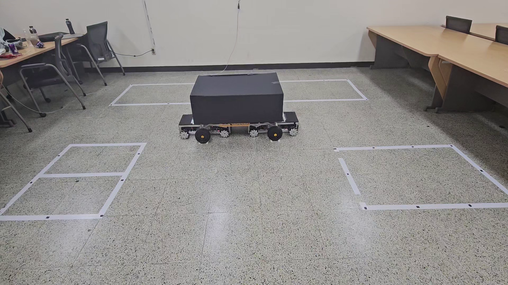
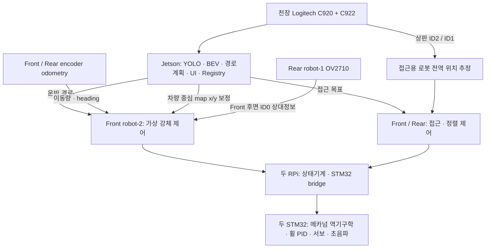

# Adaptive Valet Bot / parkingbot 1.11.3

천장 카메라의 공유 전역 인지와 두 메카넘 로봇의 근거리 제어를 결합해,
차량모형을 지정 주차면으로 운반하고 다시 회수하는 축소형 협동 주차로봇 프로젝트다.
ROS 2 Humble, Jetson 인지·관제 UI, Raspberry Pi 제어와 STM32F401RE 펌웨어를 포함한다.

*2026-09-02 제공 영상 1의 약 210.8초 원본 프레임.*

## 구현과 시연

- 복수 CCTV의 YOLO11n-Seg 차량 검출, 렌즈 보정·Homography와 BEV 지도 통합
- Front-first 접근, 초음파 차축 정렬, 서보 인양 명령과 결합 footprint 경로계획
- 가상 강체 협동제어: YOLO 전역 `x/y`, encoder odometry, Rear ID0 상대정보의 역할 분담
- 주차·인증 기반 출차, SQLite Parking Registry, 슬롯 상태와 두 로봇 HOME 복귀 관리
- 제공된 두 실기 영상에서 하부 진입, 차량과 두 로봇의 동반 이동,
  차량 정지 후 로봇 이탈·복귀 장면 확인

[시연 장면·원본 식별정보·검증 결과](docs/FINAL_VALIDATION_2026-09-04.md)에
영상별 시간 위치와 확인 범위를 기록했다. 두 영상은 주차 방향과 회수 방향의
시연 자료다.

## 시스템과 제어 역할

YOLO 차량 중심은 운반체의 **전역 x/y 위치 편차**를 보정한다. 운반체 heading은
Front/Rear odometry로 계산하고, 두 로봇의 상대 횡방향·yaw 관계는 Rear가 보는
Front 후면 ID0로 보정한다. YOLO 관측을 두 로봇의 상대 formation에 직접 주입하지 않는다.
Front의 OV2710은 보조 영상·확장용이며, 현재 `front_robot.launch.py`의 필수 인식경로에는 없다.
세부 계약은 [시스템 인수인계](docs/our_robot/SYSTEM_HANDOFF.md)를 따른다.

## 현재 검증 범위

| 구분 | 확인 범위 |
|---|---|
| 코드 | park/retrieve, 접근·정렬·운반·복귀와 전역/상대 보정 구현 |
| 축소형 시연 | 제공 영상 2건에서 이동·이탈·복귀 흐름 확인 |
| 자동 회귀 | GitHub Python CI의 실행 항목과 결과로 판단; 실기시험과 구분 |
| 실차급·무인 하중 운용 | 검증 범위 밖; [실차 준비도](docs/REAL_WORLD_READINESS.md) 적용 |

현재 launch의 `stop_after_align` 기본값은 `false`다. 정렬까지만 시험하려면 양쪽
로봇에 `stop_after_align:=true`를 명시한다. 현장 운용에는 [실차 준비도](docs/REAL_WORLD_READINESS.md)의
단계별 안전 절차를 적용한다.

## 실행·자료 안내

- [현재 통합 상태](docs/CURRENT_INTEGRATION_STATUS.md) — 기준 SHA, 소프트웨어·시연·배포 상태
- [실차 탑재·실행 Runbook](docs/REAL_ROBOT_DEPLOYMENT_RUNBOOK.md) — 배포, 기동, UI, 복구
- [카메라·Calibration·실측값 기준](docs/our_robot/CAMERA_CALIBRATION_BASELINE.md)
- [Calibration pipeline](docs/pipeline.md) — 현장 보정과 preflight
- [BOM](docs/our_robot/BOM.md) · [전장·배선](docs/our_robot/ELECTRICAL_WIRING.md)
- [전체 문서 안내](docs/README.md) · [ROS 2 기능별 문서](ros2/cooperative_parking_robot/docs/README.md)

`ros2/cooperative_parking_robot`의 버전은 `setup.py`와 `package.xml` 모두 **1.11.3**이다.
STM32 기준 프로젝트는 `stm32/parking_robot`이며 Front=`robot-2`, Rear=`robot-1`의
역할별 firmware profile을 빌드한다. 배포에는 기본 branch 또는 검증된 release를 사용한다.

## 라이선스

프로젝트 자체 소스는 [MIT](LICENSE)다. 포함된 YOLO checkpoint의 `AGPL-3.0`
metadata와 STM32/CMSIS의 별도 라이선스는
[THIRD_PARTY_NOTICES.md](THIRD_PARTY_NOTICES.md)를 따른다.
