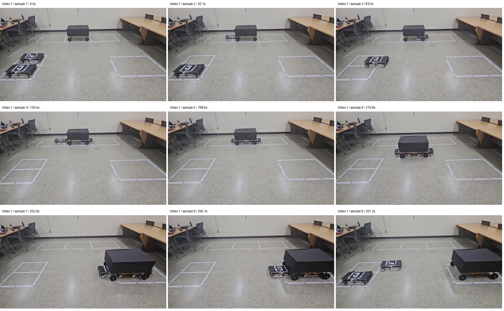
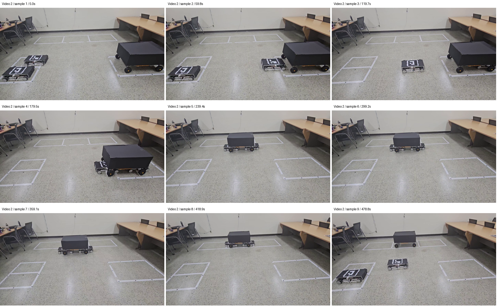

# 축소형 로봇 시연 기록 — 2026-09-04

이 문서는 현재 소스 구성과 제공 영상에서 확인한 축소형 로봇의 동작을 기록한다.
실행 절차와 안전 기준은 [현재 통합 상태](CURRENT_INTEGRATION_STATUS.md)와
[실차 준비도](REAL_WORLD_READINESS.md)를 따른다.

## 소스 기준

| 항목 | 확인 결과 |
|---|---|
| 검토 저장소/branch | `choonpal/parkingbot`, `main` |
| 검토한 소스 SHA | `6327c92e95fb3c960e42b05d44ea27e01d523077` |
| 패키지 버전 | `1.11.3` (`setup.py`, `package.xml`) |
| 문서 수정본 SHA | `hanium-2026-submission-review-20260904` 태그가 가리키는 커밋 참조; 위 소스 SHA와 구분 |

위 소스 SHA의 [Python CI 실행](https://github.com/choonpal/parkingbot/actions/runs/33648148956)은
성공했다. workflow는 compile과 지정된 ROS 비의존 회귀를 실행한다.
`rclpy`가 없는 runner에서는 ROS-node 검사가 skip된다.
이전 clean Humble build·벤치 결과는 [TEST_LOG](our_robot/TEST_LOG.md)에 보존한다.

제출 검토 태그는 문서와 시연 자료를 고정하는 스냅샷이다.

## 실기체와 시험 조건

- 실기체: Front=`robot-2`, Rear=`robot-1`의 메카넘 로봇 2대와 축소형 차량모형
- 환경: 제공 영상의 실내 시험구역, 테이프로 표시한 대기·주차 영역
- 천장 인지 구성: 팀 보유 C920/C922 각 1대; Rear OV2710은 Front ID0 상대측위
- 기구·카메라 설정: [카메라·실측 기준](our_robot/CAMERA_CALIBRATION_BASELINE.md)에서 원본 설정 위치 참조

## 원본 영상

촬영일은 파일명 기준 `2026-09-02`다. 원본은 운영자가 보관하며 Jetson 홈에도
아래 파일명으로 전달했다. 저장소에는 원본에서 추출한 대표 PNG 장면을 포함한다.

| 식별 | 원본 파일명 | 크기 | 영상 길이 |
|---|---|---:|---:|
| 영상 1 | `2026_09_02 21_59.mp4` | 141,121,610 bytes | 약 351.33초 (5분 51초) |
| 영상 2 | `2026_09_02 21_59 (1).mp4` | 205,591,546 bytes | 약 498.77초 (8분 19초) |

SHA-256:

```text
영상 1: 37a210e4955a0202152483e596e6e9137d0e287c9d763c650871ad3ec6e04bbd
영상 2: c108a3ea6a462aa2cba9e5006e781cd9cb32d25e8faa3884862bbf7b152438b1
```

영상 길이는 파일 프레임 수/FPS 기준이다.
시간 위치는 파일 시작 기준이다. 아래 정지화면은 원본 영상에서 추출했고,
모아보기에는 크기 축소와 시간 표기만 적용했다.

### 영상 1 — 대기 위치에서 오른쪽 주차면 방향



| 시간 위치 | 영상에서 관찰한 동작 |
|---|---|
| 약 3.5초 | 두 로봇과 차량모형의 초기 배치 |
| 약 42.1~168.6초 | 로봇의 접근·하부 진입과 두 로봇 배치 변화 |
| 약 210.8~252.9초 | 차량과 두 로봇이 오른쪽 주차면 방향으로 이동 |
| 약 295.1~337.2초 | 차량을 둔 상태에서 로봇 이탈과 대기 영역 방향 복귀 |

### 영상 2 — 오른쪽 주차면에서 대기 위치 방향



| 시간 위치 | 영상에서 관찰한 동작 |
|---|---|
| 약 5.0초 | 오른쪽 영역의 차량과 분리된 두 로봇 |
| 약 59.8~179.5초 | 차량 쪽 접근과 하부 배치 |
| 약 239.4~418.9초 | 차량과 로봇의 동반 이동·위치 변화 |
| 약 478.8초 | 차량을 대기 위치에 둔 뒤 로봇 이탈·복귀 장면 |

## 시연 요약

| 동작 | 영상 근거 |
|---|---|
| 차량 하부 접근·진입 | 두 영상의 접근·하부 배치 장면 |
| 차량과 두 로봇의 동반 운반 | 두 영상의 차량·로봇 위치 변화 |
| 주차 방향 이동·로봇 이탈 | 영상 1의 오른쪽 주차면 이동과 복귀 장면 |
| 회수 방향 이동·로봇 이탈 | 영상 2의 대기 위치 이동과 복귀 장면 |

## 관련 문서

- [시험 기록](our_robot/TEST_LOG.md) — 벤치 수치와 날짜별 시험 이력
- [문제 기록](our_robot/KNOWN_ISSUES.md) — 관측한 문제와 수정 내역
- [카메라·실측 기준](our_robot/CAMERA_CALIBRATION_BASELINE.md) — 카메라 역할과 설정 위치
