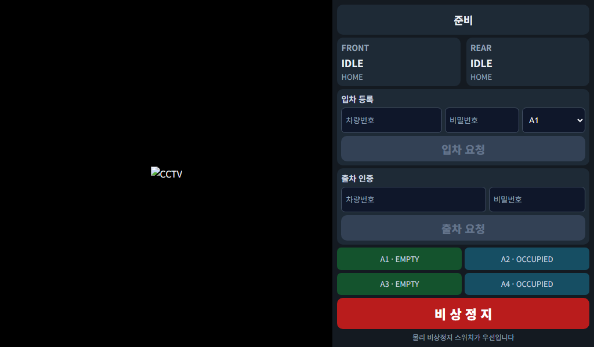

# 실차 탑재·실행 통합 Runbook

이 문서는 현재 저장소의 ROS 2 노드, STM32CubeIDE 프로젝트, 7인치 UI와
SQLite Parking Registry를 실제 장비에 올리는 기준 절차다. 소프트웨어 테스트
통과는 하중 안전을 보증하지 않는다. 보호 지그, 물리 비상정지, 사람 감독 없이
차량을 인양하지 않는다.

## 1. 기준 구성

| 장비 | 기준 환경 | 역할 |
|---|---|---|
| Jetson Orin Nano | Ubuntu 22.04 / ROS 2 Humble | CCTV, BEV, Fleet, SQLite Registry, Web UI |
| Front Raspberry Pi 4 | Ubuntu 22.04 / ROS 2 Humble | Front FSM, 강체 운반 master, Front STM32 bridge |
| Rear Raspberry Pi 4 | Ubuntu 22.04 / ROS 2 Humble | Rear FSM, Rear STM32 bridge, Rear camera |
| STM32 2대 | STM32F401RETx | 각 로봇의 모터, encoder, servo, ultrasonic |
| 7인치 터치 화면 | landscape 1024×600 권장 | Jetson의 `/kiosk` 표시 |

모든 Linux 장비는 같은 LAN, `ROS_DOMAIN_ID`와 NTP/chrony 시각을 사용한다.
Fleet와 Registry의 단일 writer는 Jetson의 `fleet_manager_node`다.

## 2. GitHub에서 각 Linux 장비로 배포

각 장비에서 SSH key가 GitHub에 등록되어 있다고 가정한다.

```bash
git clone --branch feature/exit-mission-integration git@github.com:choonpal/parkingbot.git ~/parkingbot
mkdir -p ~/parkingbot_ws/src
ln -s ~/parkingbot/ros2/cooperative_parking_robot ~/parkingbot_ws/src/cooperative_parking_robot

source /opt/ros/humble/setup.bash
cd ~/parkingbot_ws
rosdep install --from-paths src --ignore-src -r -y
colcon build --symlink-install --packages-select cooperative_parking_robot
source install/setup.bash
colcon test --packages-select cooperative_parking_robot
colcon test-result --verbose
```

업데이트할 때는 미션과 모터 전원을 먼저 끄고 다음 순서를 사용한다.

```bash
cd ~/parkingbot
git pull --ff-only
cd ~/parkingbot_ws
source /opt/ros/humble/setup.bash
colcon build --symlink-install --packages-select cooperative_parking_robot
```

세 장비의 shell 시작 설정은 동일하게 맞춘다.

```bash
source /opt/ros/humble/setup.bash
source ~/parkingbot_ws/install/setup.bash
export ROS_DOMAIN_ID=42
export ROS_LOCALHOST_ONLY=0
export RMW_IMPLEMENTATION=rmw_fastrtps_cpp
```

## 3. Parking Registry SQLite

별도 DB server나 Python package는 필요 없다. Python 표준 `sqlite3`가
다음 기본 파일을 만든다.

```text
~/.ros/adaptive_valet_bot/parking_registry.db
```

DB에는 slot lifecycle, 차량번호, final pose, parking direction, vehicle spec,
PBKDF2 iterations/salt/digest가 저장된다. 비밀번호 원문은 저장하지 않는다.
파일 권한은 시작 시 `0600`으로 제한된다.

### 최초 기동

1. 실제 모든 slot이 비었는지 확인한다.
2. 최종 `parking_layout.yaml`을 먼저 등록한다.
3. 과거 DB가 없는 상태에서 Fleet를 처음 시작한다.
4. Fleet가 등록 slot을 `EMPTY`로 생성했는지 UI에서 확인한다.

DB는 schema version, slot 목록과 slot geometry fingerprint에 묶인다. layout을
바꾼 뒤 과거 DB를 억지로 사용하지 않는다.

### 정상 재시작

모든 slot이 `EMPTY` 또는 `OCCUPIED`인 안정 상태라면 Fleet/Jetson 재시작 후
기존 record가 복원된다. Web UI만 재시작해도 `/fleet/state`를 다시 받아
차량/slot 표시가 복원된다.

### 시작이 차단되는 경우

저장 상태가 `RESERVED`, `EXIT_RESERVED`, `EXITING`이거나 DB/layout/schema가
불일치하면 Fleet는 fail-closed로 시작하지 않는다. 다음 순서로 처리한다.

1. 모터 전원을 차단하고 실제 차량과 두 로봇의 위치를 확인한다.
2. DB 파일을 별도 이름으로 복사 또는 이동해 보존한다.
3. 실제 주차장을 전부 비운 경우에만 새 DB로 초기화한다.
4. 차량이 남아 있다면 현재 버전에는 자동 reconciliation 도구가 없으므로
   수동으로 차량을 제거한 뒤 재등록한다.

미션 중간 DB를 SQL로 직접 `OCCUPIED` 또는 `EMPTY`로 고쳐 운행하지 않는다.

## 4. STM32 프로젝트 빌드와 플래시

플래시 대상은 `stm32/parking_robot`이다. 이 디렉터리에는
`parking_robot.ioc`, HAL/CMSIS, startup, linker script와 통합 제어 소스가
포함되어 있다.

1. STM32CubeIDE에서 `File → Import → Existing Projects into Workspace`를
   선택하고 `stm32/parking_robot`을 연다.
2. MCU가 `STM32F401RETx`, toolchain이 STM32CubeIDE인지 확인한다.
3. `main.c`의 USER CODE 구간에 `Robot_Init()`과 `Robot_MainLoop()` 호출이
   남아 있는지 확인한다.
4. `parking_robot_firmware.c`가 build source에 포함되는지 확인한다.
5. Clean/Build 후 error 0개인지 확인한다.
6. 모터 전원을 분리한 상태에서 ST-LINK로 Front와 Rear 보드에 각각 플래시한다.
7. UART만 연결해 `HB/ACK`, `E,...`, `U,L|R,...` 프레임을 먼저 확인한다.

CubeMX를 다시 Generate Code할 때 USER CODE 구간과 별도 firmware 파일을
보존하고, 생성 뒤 Git diff로 timer/pin 변경을 반드시 확인한다.

## 5. STM32F401RE 정확한 핀 배치

아래 표는 현재 `parking_robot.ioc`와 생성된 `main.h`의 권위값이다.
Front/Rear는 같은 firmware mapping을 쓴다.

| 기능 | MCU 핀 | Peripheral | 펌웨어 의미 |
|---|---|---|---|
| FL motor PWM | PA8 | TIM1 CH1 | Front-left |
| FR motor PWM | PA9 | TIM1 CH2 | Front-right |
| RL motor PWM | PA10 | TIM1 CH3 | Rear-left |
| RR motor PWM | PA11 | TIM1 CH4 | Rear-right |
| FL motor DIR | PC0 | GPIO output | MOTOR1_DIR |
| FR motor DIR | PC1 | GPIO output | MOTOR2_DIR |
| RL motor DIR | PC2 | GPIO output | MOTOR3_DIR |
| RR motor DIR | PC3 | GPIO output | MOTOR4_DIR |
| FL encoder A/B | PA15 / PB3 | TIM2 CH1/CH2 | 32-bit counter |
| FR encoder A/B | PB4 / PB5 | TIM3 CH1/CH2 | 16-bit counter |
| RL encoder A/B | PB6 / PB7 | TIM4 CH1/CH2 | 16-bit counter |
| RR encoder A/B | PA0 / PA1 | TIM5 CH1/CH2 | 32-bit counter |
| Left servo PWM | PB8 | TIM10 CH1 | grip servo index 0 |
| Right servo PWM | PB9 | TIM11 CH1 | grip servo index 1 |
| RPi UART TX | PA2 | USART2 TX | 115200 8N1 |
| RPi UART RX | PA3 | USART2 RX | 115200 8N1 |
| Left ultrasonic TRIG | PC8 | GPIO output | ULTRASONIC1 |
| Left ultrasonic ECHO | PC6 | EXTI6 both edges | ULTRASONIC1 |
| Right ultrasonic TRIG | PC5 | GPIO output | ULTRASONIC2 |
| Right ultrasonic ECHO | PC7 | EXTI7 both edges | ULTRASONIC2 |
| ST-LINK SWDIO/SWCLK | PA13 / PA14 | Serial Wire | debug/programming |
| External clock | PH0 / PH1 | HSE | board clock |

Timer 기준:

- TIM1 motor PWM: prescaler 0, ARR 65535. Firmware가 0~999 PID 출력을 현재
  ARR 전체 범위로 환산한다.
- TIM2/TIM5: encoder mode TI12, 32-bit period.
- TIM3/TIM4: encoder mode TI12, 16-bit rollover를 signed delta로 처리한다.
- TIM9: prescaler 83, period 65535, 84 MHz timer clock에서 1 µs tick.
- TIM10/TIM11: prescaler 83, period 19999, 50 Hz servo PWM.

### 배선 안전

- HC-SR04 ECHO의 5 V를 MCU에 직접 넣지 않는다. 3.3 V level shifter 또는
  검증된 저항분압을 사용한다.
- RPi UART와 STM32는 공통 GND를 연결하며 TX↔RX를 교차한다.
- 모터/servo 전원은 RPi 5 V pin에서 공급하지 않는다.
- 모터 driver, servo, 연산 전원을 분리 분기하고 적절한 fuse를 둔다.
- 물리 비상정지가 motor power를 실제 차단하는지 먼저 시험한다.
- PA15/PB3/PB4를 사용하므로 full JTAG가 아니라 SWD(PA13/PA14)를 유지한다.

## 6. 현장 calibration asset

Jetson의 기본 runtime 디렉터리는 다음과 같다.

```text
~/.ros/adaptive_valet_bot/
  parking_layout.yaml
  parking_registry.db
  homography_cam0_rectified.npy
  homography_cam2_rectified.npy
```

추가로 CCTV별 intrinsic NPZ, Rear camera intrinsic NPZ와 vehicle segmentation
model이 필요하다. Homography와 layout은 반드시 rectified image와 같은
`map` frame/metre 좌표를 사용한다. 등록 방법은 `docs/pipeline.md`와
`ros2/cooperative_parking_robot/docs/CCTV_CALIBRATION.md`를 따른다.

## 7. 분산 기동 순서

작업구역을 비우고 처음에는 모터 전원을 끈다.

### 7-1. Jetson

권장 실증 구성은 dual CCTV다.

```bash
ros2 launch cooperative_parking_robot cctv_server_dual.launch.py \
  enable_opencv_camera:=true \
  camera0_id:=0 camera2_id:=2 \
  cctv0_camera_calib:=<cam0.npz> \
  cctv2_camera_calib:=<cam2.npz> \
  homography_cam0_file:=<cam0.npy> \
  homography_cam2_file:=<cam2.npy> \
  layout_config:=<parking_layout.yaml> \
  model_path:=<vehicle_seg.engine> \
  parking_registry_db_path:=~/.ros/adaptive_valet_bot/parking_registry.db \
  enable_operator_ui:=true \
  enable_debug_overlay:=false \
  simultaneous_entry:=false
```

`enable_operator_ui`는 kiosk/API를 켜고 `enable_debug_overlay`는 선택 진단
overlay만 켠다. 둘은 독립 설정이다.

### 7-2. Rear Raspberry Pi

```bash
ros2 launch cooperative_parking_robot rear_robot.launch.py \
  serial_port:=/dev/serial/by-id/<rear-stm32> \
  enable_serial:=true require_serial:=true \
  require_hardware_ready:=true require_ultrasonic_for_ready:=true \
  camera_calib:=<rear_camera_calibration.npz> \
  wheelbase:=<실측> wheel_radius:=<실측> encoder_ppr:=<실측> \
  lx:=<실측> ly:=<실측> \
  left_sensor_to_gripper_x_m:=<실측> \
  right_sensor_to_gripper_x_m:=<실측> \
  simultaneous_entry:=false
```

### 7-3. Front Raspberry Pi

```bash
ros2 launch cooperative_parking_robot front_robot.launch.py \
  serial_port:=/dev/serial/by-id/<front-stm32> \
  enable_serial:=true require_serial:=true \
  require_hardware_ready:=true require_ultrasonic_for_ready:=true \
  wheelbase:=<실측> wheel_radius:=<실측> encoder_ppr:=<실측> \
  lx:=<실측> ly:=<실측> \
  left_sensor_to_gripper_x_m:=<실측> \
  right_sensor_to_gripper_x_m:=<실측> \
  use_aruco_distance:=false \
  simultaneous_entry:=false
```

실측 `aruco_distance_offset_m`이 검증된 뒤에만 거리 융합을 켠다. 현재 demo
layout은 동시 접근 시 모든 slot의 robot clearance를 위반하므로 park/retrieve
모두 기존 sequential Front-first 접근을 기본으로 쓴다.

## 8. 7인치 터치 UI



위 이미지는 실제 kiosk HTML을 1024×600 Chrome으로 렌더링한 layout
preview다. 상태값과 CCTV 영역만 검증용 예시이며 실차 topic 결과가 아니다.

Jetson 화면을 landscape 1024×600으로 설정하고 다음 주소를 연다.

```text
http://127.0.0.1:5000/kiosk
```

Chromium이 설치된 경우 자동 kiosk 예시는 다음과 같다.

```bash
chromium-browser --kiosk --noerrdialogs http://127.0.0.1:5000/kiosk
```

화면은 1024×600을 우선 설계하고 800×480까지 compact media query를 적용한다.
입력·select·mission button은 최소 44 px touch target이다. 화면에는 내부
vehicle pose/spec/password verifier를 표시하지 않는다.

입차:

1. 차량번호와 4~64자 비밀번호를 입력한다.
2. UI에 `EMPTY`로 보이는 원하는 slot을 선택한다.
3. 입차 요청 후 Fleet `ACCEPTED`를 확인한다.
4. 양쪽 HOME 뒤 입차 완료 toast와 `OCCUPIED` slot을 확인한다.

출차:

1. 입차 때의 차량번호와 비밀번호를 입력한다.
2. Fleet가 인증된 Registry record로 source slot을 찾는다.
3. 양쪽 HOME 뒤 출차 완료 toast와 `EMPTY` 전환을 확인한다.

Web UI는 제출만 한다. 실제 승인/거부, target pose/spec, mission ID와 slot
lifecycle은 Fleet가 결정한다.

## 9. 기동 직후 합격 확인

```bash
ros2 topic echo /front/hardware_ready
ros2 topic echo /rear/hardware_ready
ros2 topic hz /front/wheel_odom
ros2 topic hz /rear/wheel_odom
ros2 topic hz /front/ultrasonic_left
ros2 topic hz /rear/ultrasonic_left
ros2 topic echo /front/localization_status
ros2 topic echo /rear/localization_status
ros2 topic echo /cctv/merge_status
ros2 topic echo /fleet/state
ros2 topic info /parking/map --verbose
```

최소 합격 기준:

- 양쪽 `hardware_ready=true` 유지
- UART heartbeat/ACK 정상, 단절 후 300 ms 안에 STM32 motor stop
- 각 ultrasonic 12~16 Hz, 0.5 s 이내 freshness
- CCTV Homography RMS < 0.02 m
- `/parking/map` publisher 정확히 하나
- 양쪽 localization initialized, stale/gate 연속 오류 없음
- UI가 fault/active mission/HOME 미완료 상태에서 요청을 활성화하지 않음

## 10. 단계별 실차 시험

| 단계 | 시험 | 통과 전 금지 |
|---:|---|---|
| 0 | 전원, 분압, fuse, 물리 ESTOP | MCU/센서 전원 인가 |
| 1 | UART only, motor power OFF | PWM 구동 |
| 2 | 바퀴 하나씩 jack-up, command/encoder sign | 바닥 주행 |
| 3 | 로봇 한 대 저속 전후/횡/회전 | 두 로봇 접근 |
| 4 | 두 로봇 빈손 Front-first 접근 | 차량 진입 |
| 5 | 초음파 차축 중심 20회 반복 | servo grip |
| 6 | servo 무부하와 ESTOP hold | 하중 인양 |
| 7 | 보호 지그 저하중 | 전체 cycle |
| 8 | park→HOME→Fleet restart→retrieve→HOME | 시연 |

초기 속도는 0.03~0.05 m/s로 제한한다. 각 단계가 실패하면 다음 단계로
진행하지 않는다.

## 11. 해결해야 하는 과제

### P0 — 실차 인양 전 필수

- 실제 wheel radius, encoder PPR, `lx/ly`와 네 motor/encoder sign 확정
- 무부하/저하중 motor PID와 PWM tuning
- Front/Rear ultrasonic offset, threshold, lateral sign 20회 통계
- CCTV/Rear camera calibration과 ArUco offset 실측
- 물리 ESTOP, fuse, level shifting, 공통 GND와 낙하 방지 지그
- `GRIP_DONE`과 별개의 실제 파지/하중 확인 sensor 추가

마지막 항목이 없으면 사람 없는 무인 인양은 NO-GO다.

### P1 — 시연 안정화

- ROS 2 Humble 실제 세 장비에서 장시간 DDS/clock/freshness 시험
- 모든 실제 slot의 source 접근 corridor와 extraction/waiting insertion 반복시험
- Jetson 재부팅 뒤 SQLite `OCCUPIED` 복원 및 인증 출차 시험
- 중간 crash 때 DB를 안전하게 quarantine/reset하는 운영 훈련
- 7인치 touch calibration, on-screen keyboard와 kiosk 자동시작 설정
- 내부 신뢰망이 아닌 경우 HTTPS, 사용자 인증과 rate limiting 추가

### P2 — 다음 기능 범위

- transient mission crash recovery와 Perception 기반 Registry reconciliation
- reverse/unknown parking direction 출차 알고리즘
- 동적 장애물 재계획과 운반 중 obstacle stop
- password 변경/분실 복구와 감사 log
- Registry schema migration/backup 관리 도구
- 복수 waiting destination과 병렬 mission 지원

## 12. 현재 알려진 한계

- 출차 target은 저장된 final pose를 사용하며 주차 뒤 사람이 차량을 움직이지
  않았다는 demo 조건에 의존한다.
- 출차는 이 시스템이 forward로 주차한 차량만 지원한다.
- source robot 접근은 막히면 거부하며 새 우회 planner를 만들지 않는다.
- loaded A*는 주행 중 동적 재계획하지 않는다.
- 출차 중 waiting zone에 새 입차 차량을 두지 않는다.
- HTTP와 ROS String payload는 암호화되지 않는다. 비밀번호 원문은 DB/log에는
  남지 않지만 전송은 격리된 신뢰 LAN에서만 한다.
- SQLite는 안정 `EMPTY/OCCUPIED`만 자동 복원한다. 미션 중간 상태는 운영자
  확인 없이는 재개하지 않는다.
- 소프트웨어 ESTOP은 인증된 기능 안전 장치를 대체하지 않는다.

세부 calibration과 시험 항목은 `docs/pipeline.md`,
`docs/REAL_WORLD_READINESS.md`와 package의 `docs/HARDWARE_READINESS.md`를
함께 확인한다.
